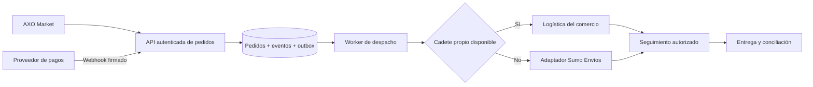

# Arquitectura y límites verificables

## Implementado

Landing prerenderizada con Next.js App Router. Interactividad en componentes cliente acotados. Endpoint Node.js `/api/investors` con validación y envío por HTTPS a Resend. Fuente local, catálogo local, sin mapas externos ni rastreadores. El único envío de información personal ocurre al presentar el formulario y únicamente si el canal está configurado.

El simulador de trazabilidad usa estados `0..4` y una selección de logística. Cada avance produce un evento visible con el mismo pedido demo; un pago rechazado impide pasar del estado inicial. Los eventos no constituyen un registro persistente ni una prueba de una operación real. Los horarios y coordenadas son ilustrativos.

## Arquitectura propuesta para la plataforma transaccional

### Contrato de eventos propuesto

`event_id`, `order_id`, `merchant_id`, `type`, `occurred_at`, `version`, `actor_id`, `payload` y `correlation_id`. El servidor emite eventos después de confirmar cada transición. La aplicación de cliente no puede declarar un pago aprobado.

### Condiciones de producción

- Verificar firma, monto, moneda, comercio y referencia del pago. Procesar webhooks de forma idempotente y tolerar reintentos / eventos fuera de orden.
- Guardar pedido, transición y outbox en una misma transacción. Reintentar despachos con deduplicación; si no hay conductor disponible, mantener un estado de excepción visible.
- Compartir únicamente pedidos autorizados con cada rol. Limitar y registrar acceso a ubicación, conservar coordenadas solo el tiempo necesario y no publicar la ruta de personas a visitantes anónimos.
- Medir entregas, cancelaciones, costos, conciliación, margen y retención antes de presentar métricas a inversores.
- Definir moneda, entidad cobradora y requisitos locales por país. La demo no presupone autorización de viajes o entregas transfronterizas.

No se han suministrado credenciales, contratos, API de Sumo, base de datos de producción, dominio verificado ni acuerdos comerciales. La entrega cubre la landing y su canal de solicitudes configurable.
